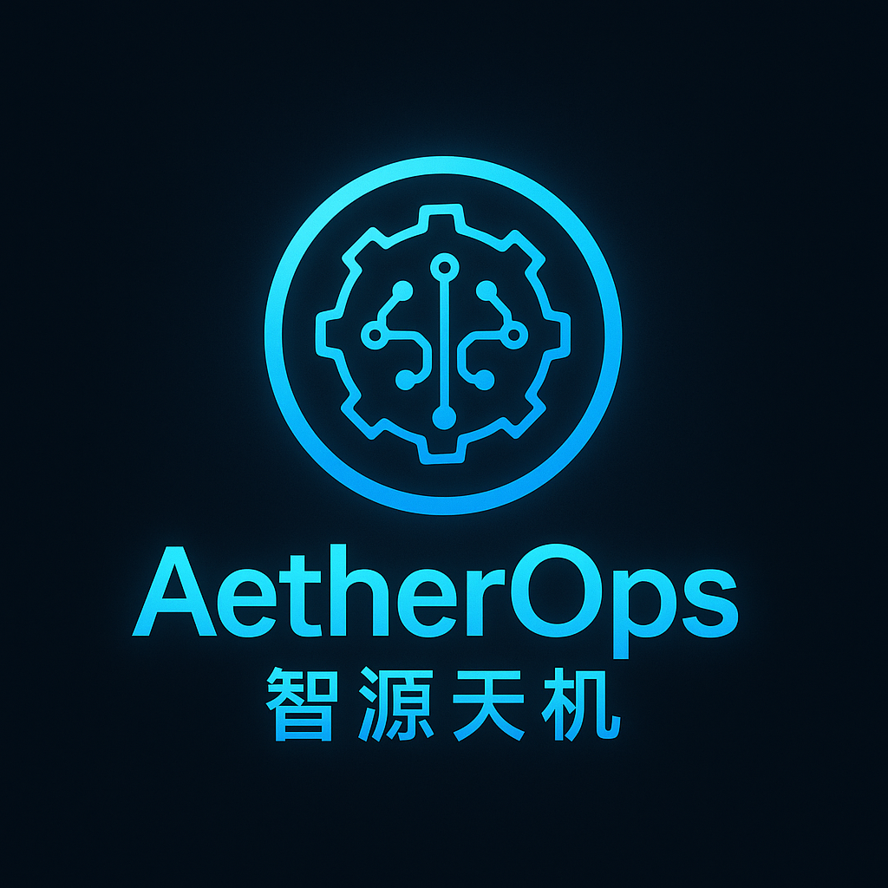

# AetherOps - AI驱动的智能运维平台

<div align="center">



<h3>让运维更智能、更高效、更安全</h3>
<h4>助力企业迈向"零人工干预"的未来！</h4>

<div>
  
  
  
  
</div>

</div>

---

## 📖 产品概述

<div align="center">

AetherOps 是一款面向中大型企业与技术团队的 **AI驱动 DevOps 平台**，致力于实现全流程的自动部署、智能运维、系统自愈、AI辅助修复与环境重构，打造"零人工干预"的下一代运维体验。

</div>

### 🎯 目标用户

<div style="display: flex; justify-content: space-between; flex-wrap: wrap; gap: 20px;">
  <div style="flex: 1; min-width: 250px; padding: 15px; background: #f8f9fa; border-radius: 8px;">
    <h4>中大型互联网公司</h4>
    <p>DevOps 团队</p>
  </div>
  <div style="flex: 1; min-width: 250px; padding: 15px; background: #f8f9fa; border-radius: 8px;">
    <h4>SaaS/云服务平台</h4>
    <p>技术部门</p>
  </div>
  <div style="flex: 1; min-width: 250px; padding: 15px; background: #f8f9fa; border-radius: 8px;">
    <h4>金融、制造、能源</h4>
    <p>高稳定性要求企业</p>
  </div>
  <div style="flex: 1; min-width: 250px; padding: 15px; background: #f8f9fa; border-radius: 8px;">
    <h4>中小科技公司</h4>
    <p>研发效率要求高</p>
  </div>
</div>

## ✨ 核心功能

<div style="display: grid; grid-template-columns: repeat(auto-fit, minmax(300px, 1fr)); gap: 20px; margin: 20px 0;">

### 1. 智能部署引擎
<div style="background: #f8f9fa; padding: 15px; border-radius: 8px;">
- 自动识别代码/配置变更
- AI生成部署脚本
- 支持多云环境（K8s、Docker、Aliyun、AWS）部署
</div>

### 2. AI系统监控
<div style="background: #f8f9fa; padding: 15px; border-radius: 8px;">
- 实时指标感知
- 异常检测
- 预测性维护
- AI识别"潜在风险"并自动响应
</div>

### 3. AI修复中心
<div style="background: #f8f9fa; padding: 15px; border-radius: 8px;">
- 故障自动诊断
- AI生成代码补丁
- 逻辑重写
- 灰度发布验证
</div>

### 4. 环境自愈能力
<div style="background: #f8f9fa; padding: 15px; border-radius: 8px;">
- 快速根因识别
- 自动恢复依赖
- 服务状态重建
- 环境一致性保证
</div>

### 5. 根因分析（RCA）助手
<div style="background: #f8f9fa; padding: 15px; border-radius: 8px;">
- 多维度数据分析
- 智能因果推断
- 历史案例匹配
- 自动化报告生成
</div>

### 6. 自定义知识增强
<div style="background: #f8f9fa; padding: 15px; border-radius: 8px;">
- 企业文档集成
- 标准流程接入
- 配置库管理
- 专属AI运维助手
</div>

</div>

## 💡 用户痛点解决方案

<div style="overflow-x: auto;">
<table style="width: 100%; border-collapse: collapse;">
<tr style="background: #f8f9fa;">
<th style="padding: 12px; text-align: left; border-bottom: 2px solid #dee2e6;">用户痛点</th>
<th style="padding: 12px; text-align: left; border-bottom: 2px solid #dee2e6;">AetherOps 解决方案</th>
</tr>
<tr>
<td style="padding: 12px; border-bottom: 1px solid #dee2e6;">手工部署繁琐、容易出错</td>
<td style="padding: 12px; border-bottom: 1px solid #dee2e6;">AI驱动部署自动化、可视化流程编排</td>
</tr>
<tr style="background: #f8f9fa;">
<td style="padding: 12px; border-bottom: 1px solid #dee2e6;">故障响应慢、人力成本高</td>
<td style="padding: 12px; border-bottom: 1px solid #dee2e6;">7x24小时 AI 哨兵监控+异常自动处理</td>
</tr>
<tr>
<td style="padding: 12px; border-bottom: 1px solid #dee2e6;">出了问题没人能快速修复</td>
<td style="padding: 12px; border-bottom: 1px solid #dee2e6;">AI实时生成修复方案并进行安全验证</td>
</tr>
<tr style="background: #f8f9fa;">
<td style="padding: 12px; border-bottom: 1px solid #dee2e6;">环境混乱难以重建</td>
<td style="padding: 12px; border-bottom: 1px solid #dee2e6;">环境状态快照 + AI自动恢复</td>
</tr>
<tr>
<td style="padding: 12px; border-bottom: 1px solid #dee2e6;">运维知识分散、新人难接手</td>
<td style="padding: 12px; border-bottom: 1px solid #dee2e6;">内置AI知识库辅助问答，标准化运维流程</td>
</tr>
<tr style="background: #f8f9fa;">
<td style="padding: 12px; border-bottom: 1px solid #dee2e6;">运维人员知识能力界限</td>
<td style="padding: 12px; border-bottom: 1px solid #dee2e6;">依托AI强大能力，实现知识无界运维</td>
</tr>
</table>
</div>

## 🚀 快速开始

<div style="background: #f8f9fa; padding: 20px; border-radius: 8px; margin: 20px 0;">

### 环境要求
- Python 3.9+
- Docker
- Kubernetes (可选)
- Jenkins (可选)

### 安装步骤
1. 克隆仓库：
```bash
git clone https://github.com/hoeniu/AetherOps.git
cd AetherOps
```

2. 安装依赖：
```bash
pip install -r requirements.txt
```

3. 配置环境变量：
```bash
cp .env.example .env
```
编辑 `.env` 文件，填入相应配置信息。

### 配置说明
- `GITHUB_TOKEN`: GitHub 个人访问令牌
- `OPENAI_API_KEY`: OpenAI API 密钥
- `JENKINS_URL`: Jenkins 服务器地址
- `JENKINS_USERNAME`: Jenkins 用户名
- `JENKINS_TOKEN`: Jenkins API 令牌

### 启动应用
```bash
streamlit run app.py
```
访问 `http://localhost:8501` 开始使用。

</div>

## 📝 许可证

本项目采用 MIT 许可证 - 详见 [LICENSE](LICENSE) 文件

## 🤝 贡献指南

欢迎提交 Issue 和 Pull Request！

## 📞 联系我们

<div style="background: #f8f9fa; padding: 20px; border-radius: 8px; margin: 20px 0;">
如有任何问题或建议，请通过以下方式联系我们：
- 提交 Issue
- 发送邮件至：support@aetherops.com
</div> 